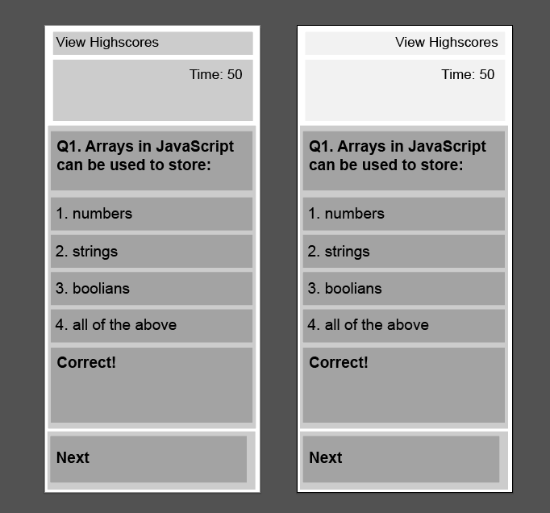
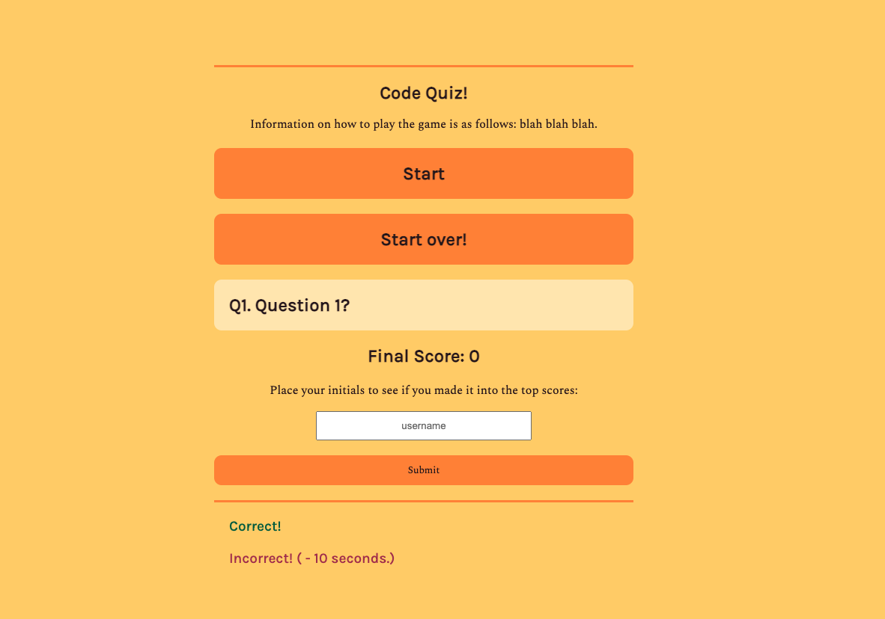
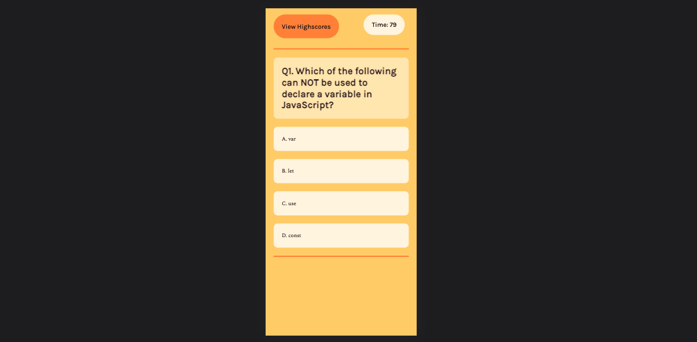
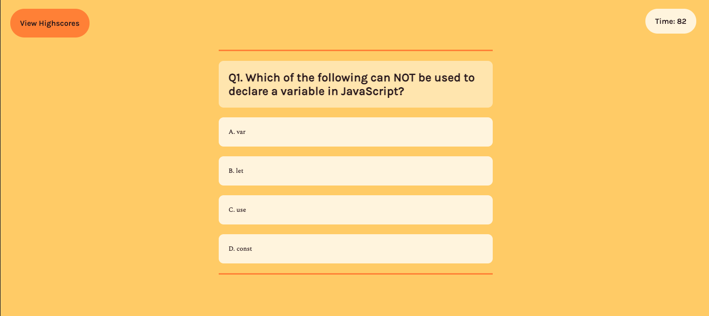

# Homework-04-Code-Quiz

## Task

This homework task required us to write the HTML, CSS, and JavaScript for a coding quiz game. It was a quite a challenge as it required a timer, local storage, and manipulating the DOM with JavaScript. Although I have made many small applications with JavaScript, this is my first project which is more than just an exercise.

I had quite a few challenges to overcome in this project. The main one being making everything work together. It is quite easy to get a timer working by itself, or to save something to local storage, but to get everything working together was very very difficult. I learnt a lot in this project, but the main thing I learned was the power of arrays and objects.

The task is as follows:

## User Story

```
AS A coding boot camp student
I WANT to take a timed quiz on JavaScript fundamentals that stores high scores
SO THAT I can gauge my progress compared to my peers
```

## Acceptance Criteria

```
GIVEN I am taking a code quiz
WHEN I click the start button
THEN a timer starts and I am presented with a question
WHEN I answer a question
THEN I am presented with another question
WHEN I answer a question incorrectly
THEN time is subtracted from the clock
WHEN all questions are answered or the timer reaches 0
THEN the game is over
WHEN the game is over
THEN I can save my initials and my score
```

## Development

To start, I came up with a simple colourless layout for a mobile first web application. I then selected a colour palette and set this to my variables. For me, the design, layout, HTML and CSS are simple, fun and quick.



After this I worked on the JavaScript. As mentioned above I had many issues. Below is a screenshot of the application when it was not working properly. Often one line of code would have an issue and sometimes it took me hours to work out what was wrong.



## Responsiveness

Because this app has a very simple layout, it was relatively easy to make it responsive with only one media query.




## Deployed Application

### Link:

[Homework 04 - Code Quiz - Clayton McIntosh](https://claytonmcintosh.github.io/Homework-04-Code-Quiz/)
